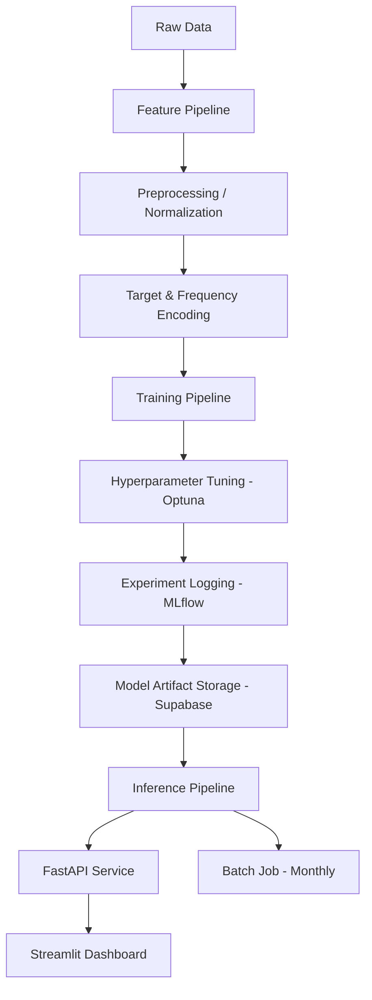

# 🏡 Housing Regression MLE: End-to-End Machine Learning Ecosystem

[](https://www.python.org/downloads/release/python-3110/)
[](https://fastapi.tiangolo.com/)
[](https://cloud.google.com/run)
[](https://supabase.com/)
[](https://mlflow.org/)

> **Housing Regression MLE** is a professional-grade, production-ready machine learning system designed to predict real estate prices with high precision. It leverages a modern MLOps stack to manage the entire lifecycle from raw data ingestion to serverless deployment.

---

## 🚀 Key Highlights

*   **State-of-the-Art Modeling**: Powered by **XGBoost** with **Bayesian Optimization** via **Optuna**.
*   **Modern Package Management**: Uses `uv` for lightning-fast dependency resolution and environment isolation.
*   **Professional MLOps**: Full experiment tracking with **MLflow** and model persistence in **Supabase Storage**.
*   **Cloud-Native Architecture**: Fully containerized with **Docker** and deployed on **Google Cloud Run** for horizontal auto-scaling and "scale-to-zero" cost efficiency.
*   **Interactive Analytics**: Includes a high-performance **FastAPI** backend and a sleek **Streamlit** interactive dashboard.
*   **Anti-Leakage Engineering**: Strict chronological data splitting and encoder persistence to ensure real-world reliability.

---

## 🏗️ System Architecture

The project follows a modular pipeline architecture, ensuring each component is testable and maintainable.



---

## 📂 Project Structure

```text
├── src/
│   ├── feature_pipeline/    # Data loading, cleaning, & feature engineering
│   ├── training_pipeline/   # XGBoost training, Optuna tuning, & MLflow logging
│   ├── inference_pipeline/  # Real-time inference logic
│   ├── batch/               # Scheduled monthly batch processing
│   ├── api/                 # FastAPI REST service
│   └── utils/               # Supabase & cloud helper clients
├── app.py                   # Streamlit Frontend Dashboard
├── notebooks/               # EDA & Prototyping
├── tests/                   # Comprehensive Unit & Integration tests
├── configs/                 # YAML-based environment configurations
└── models/                  # Local cache for serialized models & encoders
```

---

## 🛠️ Installation & Setup

### 1. Prerequisites
*   Python 3.11+
*   [`uv`](https://github.com/astral-sh/uv) installed via `pip install uv`

### 2. Quick Setup
```bash
# Clone the repository
git clone https://github.com/Vinay0905/Regression_ML_EndtoEnd.git
cd Regression_ML_EndtoEnd

# Sync dependencies and create venv
uv sync

# Activate environment
.venv\Scripts\activate  # Windows
# source .venv/bin/activate # Unix
```

### 3. Environment Variables
Create a `.env` file in the root directory:
```env
SUPABASE_URL=your_project_url
SUPABASE_KEY=your_anon_key
MLFLOW_TRACKING_URI=http://localhost:5000
```

---

## 🧪 Operational Workflow

### **Feature Engineering**
```bash
python -m src.feature_pipeline.load
python -m src.feature_pipeline.preprocess
python -m src.feature_pipeline.feature_engineering
```

### **Model Development**
```bash
# Tune hyperparameters with Optuna and log to MLflow
python src/training_pipeline/tune.py

# Evaluate the best model
python src/training_pipeline/eval.py
```

### **Deployment & API**
```bash
# Start the FastAPI server
uv run uvicorn src.api.main:app --host 0.0.0.0 --port 8000

# Launch the Streamlit Dashboard
streamlit run app.py
```

---

## 🐳 Containerization

Fully optimized for production environments using multi-stage Docker builds.

```bash
# Build & Run API
docker build -t housing-api .
docker run -p 8000:8000 housing-api

# Build & Run Dashboard
docker build -t housing-streamlit -f Dockerfile.streamlit .
docker run -p 8501:8501 housing-streamlit
```

---

## 📈 Quality Assurance

We maintain high confidence in our deployments through rigorous testing.

*   **Unit Testing**: `pytest` covers feature transforms and model prediction logic.
*   **Data Validation**: Integrated with **Great Expectations** for schema enforcement.
*   **Model Monitoring**: Planned integration with **Evidently** for drift detection.

---

## 🏷️ Technical Theory
For a deep dive into the "Why" behind our technical decisions (XGBoost vs. Deep Learning, Regression vs. Classification, etc.) and to prepare for interviews, please refer to our **[Introduction & Theory Document](./Introduction.md)**.

---

## 👤 Author
**Vinay** - [GitHub](https://github.com/Vinay0905)

*This project was built to demonstrate complete mastery of the Machine Learning Lifecycle from development to cloud-native serving.*
